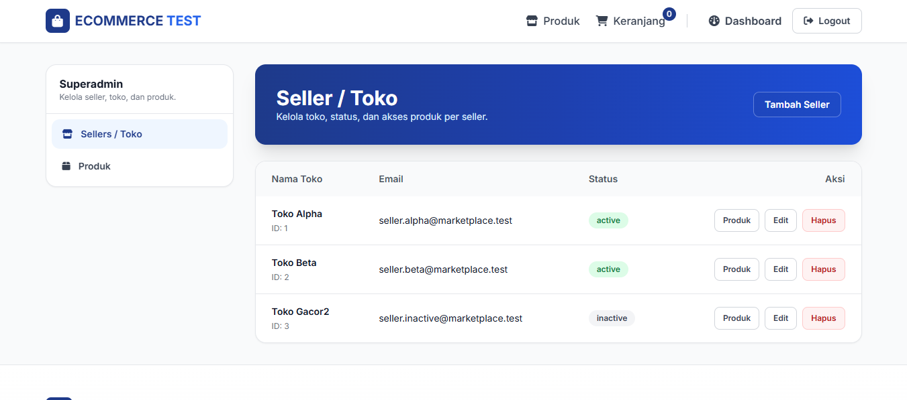
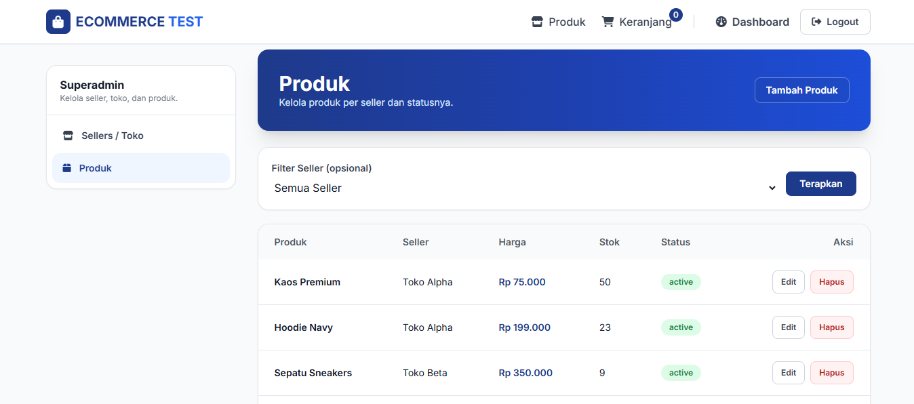
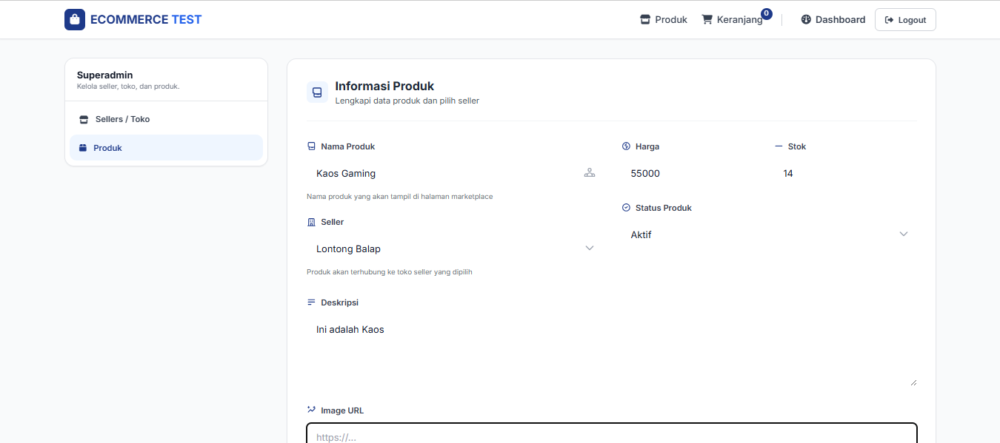
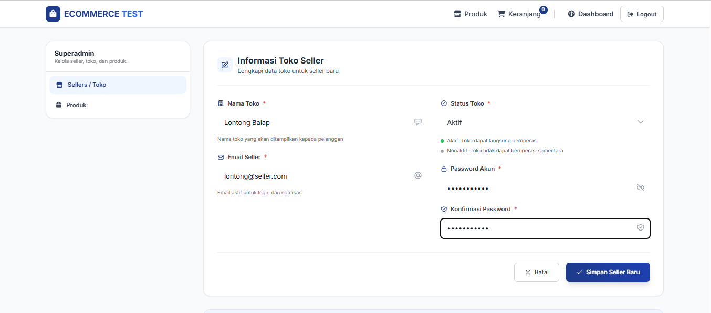

# E-Commerce Marketplace (Laravel)

Project ini adalah simulasi marketplace sederhana dengan 3 area utama:

- **Guest (pengunjung)**: melihat produk, search/filter/sort, cart, checkout.
- **Seller**: kelola toko (nama) dan kelola produk milik seller.
- **Superadmin**: kelola data seller dan produk semua seller.

Seluruh alur utama didefinisikan di `routes/web.php` (menggunakan closure), dengan model Eloquent di `app/Models`, middleware role di `app/Http/Middleware/EnsureRole.php`, dan tampilan Blade di `resources/views`.

---

## Cara setup & menjalankan project

### 1) Prasyarat

- PHP **8.2+**
- Composer
- Node.js + npm
- Database:
  - **MySQL** (sesuai `.env.example`) atau
  - **SQLite** (file sudah ada di `database/database.sqlite`)

### 2) Instalasi dependency

Jalankan:

- `composer install`
- `npm install`

### 3) Konfigurasi environment

Copy env:

- `copy .env.example .env`

Lalu generate key:

- `php artisan key:generate`

### 4) Konfigurasi database

#### Opsi A: MySQL

Di `.env` set:

- `DB_CONNECTION=mysql`
- `DB_HOST=127.0.0.1`
- `DB_PORT=3306`
- `DB_DATABASE=...`
- `DB_USERNAME=...`
- `DB_PASSWORD=...`

Lalu jalankan migrasi + seed:

- `php artisan migrate:fresh --seed`

#### Opsi B: SQLite (lebih cepat untuk demo)

Pastikan file ada:

- `database/database.sqlite`

Di `.env` set:

- `DB_CONNECTION=sqlite`
- `DB_DATABASE=database/database.sqlite`

Lalu:

- `php artisan migrate:fresh --seed`

### 5) Menjalankan aplikasi

#### Mode manual

- Backend: `php artisan serve`
- Frontend (Vite): `npm run dev`

#### Mode cepat via composer script

Project menyediakan script di `composer.json`:

- Setup sekali jalan: `composer run setup`
- Dev (server + queue + vite): `composer run dev`

Buka:

- `http://127.0.0.1:8000`

---

## Akun demo (Seeder)

Seeder ada di `database/seeders/*` dan dipanggil oleh `DatabaseSeeder`.

- **Superadmin**
  - Email: `superadmin@marketplace.test`
  - Password: `password123`
  - Login: `/login/superadmin`

- **Seller Alpha**
  - Email: `seller.alpha@marketplace.test`
  - Password: `password123`
  - Login: `/login/seller`

- **Seller Beta**
  - Email: `seller.beta@marketplace.test`
  - Password: `password123`
  - Login: `/login/seller`

Catatan: seeder juga membuat **seller nonaktif** (`inactive@seller.test`) untuk kebutuhan pengujian business rule.

---

## Penjelasan struktur project

- **`routes/web.php`**
  - Semua route utama guest/seller/superadmin (closure-based)
  - Validasi request (Laravel validator) dan transaksi DB

- **`app/Models`**
  - `User`: memiliki kolom `role` dan relasi `seller()`
  - `Seller`: relasi `products()`
  - `Product`: relasi `seller()`
  - `Cart`, `CartItem`: penyimpanan keranjang user/guest (berdasarkan session)
  - `Order`, `OrderItem`: simulasi checkout (membuat order + mengurangi stok)

- **`app/Http/Middleware/EnsureRole.php`**
  - Middleware role: jika belum login diarahkan ke `/login/{role}`, jika role tidak sesuai `abort(403)`.
  - Digunakan di group route:
    - `middleware(['role:superadmin'])`
    - `middleware(['role:seller'])`

- **`resources/views`**
  - `guest/*`: home, cart, checkout
  - `auth/*`: login seller & superadmin
  - `superadmin/*`: CRUD sellers dan products
  - `seller/*`: kelola store & products
  - `layouts/*`, `partials/*`: layout dan komponen UI

- **`database/migrations`**
  - Tabel utama: `users`, `sellers`, `products`, `carts`, `cart_items`, `orders`, `order_items`

---

## Penjelasan singkat business rule

Berikut aturan bisnis yang memang diterapkan di `routes/web.php` (bukan hanya “wacana”):

### 1) Role & akses halaman

- **Superadmin** hanya boleh akses prefix `/superadmin/*`.
- **Seller** hanya boleh akses prefix `/seller/*`.
- Jika tidak login, otomatis diarahkan ke:
  - `/login/superadmin` atau
  - `/login/seller`

### 2) Aturan Seller

- Seller memiliki `status`: `active` / `inactive`.
- **Seller berstatus inactive tidak boleh**:
  - ditambahkan produk baru (superadmin maupun seller)
  - memindahkan produk ke seller inactive

### 3) Aturan Produk

- Validasi input produk:
  - `name` wajib, max 255
  - `price` wajib numeric dan **> 0** (`gt:0`)
  - `stock` wajib integer dan **>= 0** (`min:0`)
  - `status` wajib `active|inactive`
  - `image_url` opsional max 2048

### 4) Aturan Cart

- Menambah ke cart (`/cart/add/{product}`):
  - `qty` wajib integer minimal 1
  - produk harus `status=active`
  - stok harus > 0
  - qty disimpan akan di-*clamp* ke stok tersedia (tidak bisa melebihi stok)

### 5) Aturan Checkout

- Checkout membutuhkan data:
  - `name`, `email`, `address`
- Checkout berjalan dalam `DB::transaction()` dan melakukan `lockForUpdate()` pada produk.
- Jika stok tidak cukup, transaksi dibatalkan dan user mendapat pesan error.
- Jika sukses:
  - membuat `orders` dan `order_items`
  - mengurangi `stock`
  - menambah `sold_count`
  - mengosongkan `cart_items`

---

## Bagaimana cara memastikan fitur berjalan dengan benar?

Berikut checklist uji manual yang langsung mengacu pada route + validasi yang ada.

### A) Guest / Marketplace

- **Home (list produk)**
  - Buka `/`
  - Pastikan hanya produk dengan `status=active` yang tampil.
  - Coba:
    - search `q`
    - filter availability: `in_stock` / `out_of_stock`
    - sort: `newest`, `oldest`, `price_asc`, `price_desc`, `name_asc`, `name_desc`

- **Cart**
  - Tambah produk: POST `/cart/add/{product}` dengan `qty=1`
  - Buka `/cart` dan pastikan item masuk.
  - Update qty: POST `/cart/update` (qty tidak boleh negatif; dan akan dibatasi stok).
  - Remove item: POST `/cart/remove/{product}`.

- **Checkout**
  - Buka `/checkout`.
  - Submit form checkout POST `/checkout`.
  - Pastikan:
    - order dibuat
    - stok produk berkurang
    - cart kosong

### B) Superadmin

- Login `/login/superadmin`.
- **Daftar seller**: `/superadmin/sellers`.
- Tambah seller (create), edit seller (update), hapus seller (delete).
- **Daftar produk**: `/superadmin/products`.
  - Coba filter produk per seller dengan query `?seller_id=...`.

### C) Seller

- Login `/login/seller`.
- **Kelola toko**: `/seller/store` (edit nama toko).
- **Daftar produk seller**: `/seller/products`.
- Tambah/edit/hapus produk milik seller.

---

## Contoh skenario error yang mungkin terjadi dan bagaimana penanganannya

### 1) Salah login / role tidak sesuai

- **Skenario**: login dengan email/password salah.
  - **Hasil**: redirect back dengan pesan `Email atau password salah.`

- **Skenario**: login seller tapi akun role bukan seller.
  - **Hasil**: user di-logout, redirect back dengan `Akun ini bukan seller.`

- **Skenario**: user mencoba akses `/superadmin/*` tapi rolenya seller.
  - **Hasil**: middleware `EnsureRole` melakukan `abort(403)`.

### 2) Checkout dengan cart kosong

- **Skenario**: buka `/checkout` lalu submit tanpa ada item.
  - **Hasil**: redirect back dengan pesan `Cart masih kosong`.

### 3) Stok tidak cukup saat checkout (race condition / stok berubah)

- **Skenario**: di cart qty=10, tetapi stok produk tinggal 3.
  - **Hasil**: saat checkout, sistem melempar exception:
    - `Stok tidak cukup untuk produk: ...`
  - **Penanganan**: `try/catch` di route checkout mengembalikan `back()->withInput()->with('error', $e->getMessage())`.

### 4) Produk tidak bisa ditambahkan jika seller inactive

- **Skenario**: superadmin menambah produk untuk seller berstatus `inactive`.
  - **Hasil**: `withErrors(['seller_id' => 'Produk tidak dapat ditambahkan jika seller berstatus Nonaktif.'])`

- **Skenario**: seller yang tokonya inactive mencoba menambah produk lewat `/seller/products/create`.
  - **Hasil**: redirect back dengan `Produk tidak dapat ditambahkan jika seller berstatus Nonaktif.`

---

## Contoh minimal 1 data yang gagal validasi (dan alasannya)

### Contoh 1: Gagal validasi qty cart

- Endpoint: POST `/cart/add/{product}`
- Payload:
  - `qty = 0`

**Kenapa gagal?**

Karena validasi menetapkan `qty` harus `integer` dan **minimal 1**:

- `qty` => `required|integer|min:1`

Laravel akan otomatis redirect back dan mengisi error bag (bisa ditampilkan di UI dengan `@error('qty')`).

### Contoh 2: Gagal validasi produk (harga tidak valid)

- Endpoint: POST `/seller/products`
- Payload:
  - `name = "Produk A"`
  - `price = 0`
  - `stock = 10`
  - `status = active`

**Kenapa gagal?**

Karena `price` wajib **lebih besar dari 0** (`gt:0`).

---

## Daftar halaman penting (untuk demo)

### Guest

- Home: `/`
- Cart: `/cart`
- Checkout: `/checkout`

### Auth

- Login seller: `/login/seller`
- Login superadmin: `/login/superadmin`
- Logout: POST `/logout`

### Superadmin

- Sellers
  - Index: `/superadmin/sellers`
  - Create: `/superadmin/sellers/create`
  - Store: POST `/superadmin/sellers`
  - Edit: `/superadmin/sellers/{seller}/edit`
  - Update: PUT `/superadmin/sellers/{seller}`
  - Delete: DELETE `/superadmin/sellers/{seller}`

- Products
  - Index: `/superadmin/products`
  - Create: `/superadmin/products/create`
  - Store: POST `/superadmin/products`
  - Edit: `/superadmin/products/{product}/edit`
  - Update: PUT `/superadmin/products/{product}`
  - Delete: DELETE `/superadmin/products/{product}`

### Seller

- Store
  - Edit: `/seller/store`
  - Update: PUT `/seller/store`

- Products
  - Index: `/seller/products`
  - Create: `/seller/products/create`
  - Store: POST `/seller/products`
  - Edit: `/seller/products/{product}/edit`
  - Update: PUT `/seller/products/{product}`
  - Delete: DELETE `/seller/products/{product}`

---

## Screenshot aplikasi (wajib diisi)

Screenshot di bawah menggunakan file yang sudah ada di root project.

### 1) Halaman daftar seller

### 2) Halaman daftar produk

### 3) Contoh proses tambah data (seller atau produk)

